# 🤖 Full-Stack AI News Chatbot

Welcome to the AI News Chatbot project\! This repository contains the full-stack implementation of a sophisticated, real-time conversational AI designed to deliver the latest news. It functions as a personal news assistant that ingests and understands current events to provide intelligent, contextual, and sourced answers.
This project is composed of a **React/TypeScript frontend** and a **Node.js/Express backend**, working together to create a seamless and interactive user experience.

---

## 🌐 Live Demo

Experience the AI News Chatbot in action! The application is deployed and fully operational on Render.

### 🚀 Production URLs

| Service      | URL                                                            | Status    | Description                                     |
| ------------ | -------------------------------------------------------------- | --------- | ----------------------------------------------- |
| **Frontend** | [🔗 Live App](https://news-chatbot-frontend-pyd3.onrender.com) | 🟢 Active | React-based user interface with real-time chat  |
| **Backend**  | [🔗 API Server](https://news-chatbot-server.onrender.com)      | 🟢 Active | Node.js backend with RAG pipeline and Socket.IO |

### ⚡ Quick Start

1. **[Launch the App →](https://news-chatbot-frontend-pyd3.onrender.com)** - Start chatting with the AI about the latest news
2. **API Health Check** - Visit the [backend health endpoint](https://news-chatbot-server.onrender.com/health) to verify server status
3. **Real-time Experience** - Enjoy instant responses powered by Socket.IO and Google Gemini AI

> **⚠️ Important Note:** If the frontend appears to be loading indefinitely or shows connection errors, please visit the [backend server link](https://news-chatbot-server.onrender.com) first to wake it up. Render puts free-tier services to sleep after periods of inactivity to save memory. Once the backend is awake (you'll see a response), refresh the frontend and it should work perfectly!

> **Note:** Initial load may take 30-60 seconds as Render spins up the free-tier services. Once loaded, the experience is seamless and lightning-fast!

### 🛠️ Deployment Stack

- **Platform:** Render (Frontend & Backend)
- **Database:** Qdrant Cloud (Vector Search)
- **Cache:** Redis Cloud (Session Management)
- **AI:** Google Gemini Pro (Text Generation)
- **Real-time:** Socket.IO (WebSocket Communication)

---

## ✨ Core Features

- **🧠 Retrieval-Augmented Generation (RAG):** The backend uses a RAG pipeline to provide answers that are not just generated, but are grounded in a knowledge base of real, up-to-date news articles.
- **⚡ Real-Time Communication:** A Socket.IO-based architecture provides instant message delivery, live typing indicators, and a dynamic user experience.
- **💾 Persistent Sessions:** User conversations are cached in Redis and persisted on the client via `localStorage`, allowing users to continue their conversations across browser sessions.
- **📰 Dynamic Knowledge Base:** The backend can automatically fetch and process news from various RSS feeds, keeping its knowledge base current.
- **📱 Fully Responsive UI:** The React frontend is designed with a mobile-first approach, ensuring a flawless experience on any device.
- **🛡️ Secure & Resilient:** The backend includes features like rate limiting, comprehensive error handling, and health checks for robust, production-ready performance.

---

## 🏗️ System Architecture

The application is architected with a clear separation between the frontend client and the backend server, which orchestrates all AI processing and data management.

```mermaid
graph TD
    A[🌐 React Frontend] -- Socket.IO & HTTP --> B[🚀 Node.js Backend];
    B -- "User Query" --> C[🧠 RAG Pipeline];
    C -- "Semantic Search" --> D[📚 Qdrant Vector DB];
    D -- "Relevant News Articles" --> C;
    C -- "Context + Query" --> E[🤖 Google Gemini AI];
    E -- "Generated Response" --> C;
    C -- "Final Message & Sources" --> B;
    B -- "Cache Session History" --> F[⚡ Redis Cache];
    F -- "Retrieve History on Connect" --> B;
    B -- "Real-time Events (message, typing)" --> A;
```



---

## 🛠️ Technology Deep Dive

This project leverages a modern, powerful tech stack. Here's a breakdown of every library used and why it was chosen.

### Backend Dependencies (`package.json`)

# 📚 Project Dependencies

## ⚙️ Core Framework

- **express** — The foundational web server framework for building the REST API and WebSocket server.
- **dotenv** — Loads environment variables from a `.env` file, keeping secrets out of the code.
- **cors** — Middleware to enable Cross-Origin Resource Sharing, allowing the frontend to communicate with the backend.

## 🔴 Real-Time Communication

- **socket.io** — Enables real-time, bidirectional, event-based communication between the client and server.

## 🤖 AI & Data Processing

- **@google/generative-ai** — Official SDK for interacting with Google Gemini AI to generate human-like text responses.
- **openai** — Added for potential integration with OpenAI models or services (e.g., embeddings, GPT). _(Note: Jina is primary in config)_
- **natural** — A natural language processing library for tasks like tokenization.
- **cheerio / node-html-parser** — Server-side HTML parsers for scraping and cleaning content from news articles (RSS feeds).
- **string-strip-html** — Utility to strip HTML tags, ensuring clean text for AI processing.
- **xml2js** — Parses XML data from RSS feeds into JavaScript objects.

## 🗄️ Database & Caching

- **@qdrant/qdrant-js** — Official client for interacting with the Qdrant vector database (semantic search).
- **redis / ioredis** — High-performance Redis clients for caching sessions.
- **connect-redis** — Redis session store for Express, enabling persistent sessions.

## 🔐 Security & Middleware

- **helmet** — Secures the Express app by setting critical HTTP security headers.
- **express-rate-limit** — Middleware to limit repeated requests to public APIs (prevents abuse).
- **morgan** — HTTP request logger for debugging and monitoring API traffic.

## 🛠️ Utilities

- **axios** — Promise-based HTTP client for fetching news articles from external sources.
- **uuid** — Generates unique identifiers (UUIDs) for sessions and messages.
- **nodemon** _(Dev)_ — Auto-restarts the server when file changes are detected.
- **concurrently** _(Dev)_ — Runs multiple commands concurrently (e.g., frontend + backend together).

# 🎨 Frontend Dependencies

## ⚙️ Core Framework

- **react / react-dom** — The core UI library and its DOM entry point for building component-based interfaces.

## 🏗️ Build & Tooling

- **vite** — Next-generation frontend build tool with an extremely fast dev server and optimized builds.
- **typescript** — Adds static typing to JavaScript, improving code quality, maintainability, and developer experience.
- **@vitejs/plugin-react** — Official Vite plugin for React support, including Fast Refresh.

## 🔴 Real-Time Communication

- **socket.io-client** — Client-side library for establishing and managing WebSocket connections with the backend.

## 🎨 Styling

- **sass** — A powerful CSS preprocessor enabling variables, mixins, and nested rules for structured, scalable styling.

## 🛠️ Utilities

- **axios** — Promise-based HTTP client for making REST API calls to the backend.
- **uuid** — Generates unique client-side identifiers for messages before they are sent to the server.

## ✅ Linting & Code Quality

- **eslint** — Pluggable linter for identifying and reporting JavaScript patterns to maintain consistent code quality.
- **typescript-eslint** — Toolchain that allows ESLint to properly lint TypeScript code.

## 🚀 Getting Started: Full-Stack Setup

Follow these steps to get the entire application running locally.

### Prerequisites

- Node.js (v18 or higher)
- Git
- NPM or Yarn
- **Active Cloud Accounts** for Google AI, Jina, Qdrant, and Redis.

### 1\. Clone the Repository

```sh
git clone <repository-url>
cd your-project-directory
```

### 2\. Set Up the Backend

First, navigate to the backend directory, install its dependencies, and configure its environment.

```sh
cd backend
npm install
cp .env.example .env
```

Now, **edit the `backend/.env` file** with your API keys and service URLs.

### 3\. Set Up the Frontend

Next, open a **new terminal window** and navigate to the frontend directory.

```sh
cd frontend
npm install
cp .env.example .env
```

Ensure the `frontend/.env` file points to your local backend server (e.g., `VITE_API_URL=http://localhost:3001`).

### 4\. Run the Full Application

You will need **two separate terminals** running at the same time.

- **In your backend terminal:**

  ```sh
  # This starts the backend server on http://localhost:3001
  npm run dev
  ```

- **In your frontend terminal:**

  ```sh
  # This starts the React development server on http://localhost:5173
  npm run dev
  ```

### 5\. Build the Knowledge Base

Once the backend server is running, you must trigger the initial build of the RAG knowledge base. In a third terminal, run:

```sh
curl -X POST http://localhost:3001/api/chat/rebuild
```

This process can take 5-10 minutes. Once complete, your application is fully operational. Open `http://localhost:5173` in your browser to start chatting\!

---

## 📂 Project Structure

This repository is a monorepo containing the two main packages. For a deep dive into the architecture of each part, please see their respective README files.

```
/
├── backend/          # Node.js, Express, and RAG Pipeline
│   ├── src/
│   ├── .env.example
│   ├── package.json
│   └── README.md     # <-- Detailed backend documentation
│
└── frontend/         # React, TypeScript, and Vite
    ├── src/
    ├── .env.example
    ├── package.json
    └── README.md     # <-- Detailed frontend documentation
```
