# 🤖 News AI Chatbot - Backend

Welcome to the backend for the News AI Chatbot. This is a powerful, AI-driven server that delivers intelligent, real-time news responses using a sophisticated **RAG (Retrieval-Augmented Generation)** pipeline.

Think of it as your personal news assistant that not only remembers everything it reads but can also have meaningful conversations about current events.

***

## ✨ What This Does

This server powers a conversational news chatbot that:

- **🔍 Ingests** the latest news from trusted sources across the globe
- **🧠 Understands** your questions using advanced AI embeddings
- **📚 Retrieves** relevant context from its knowledge base
- **🤖 Generates** intelligent, contextual responses using Google's Gemini AI
- **💾 Remembers** your conversation history in real-time sessions using Redis cache

***

## 🏗️ Architecture Overview

The backend is the core of the application, orchestrating data flow between the user, the AI models, the vector database, and the cache.

```mermaid
graph TD
    A[🌐 Frontend Client] -- Socket.IO & HTTP --> B{Node.js Server};
    B -- "User Query" --> C[🧠 RAG Pipeline];
    C -- "Search Vector" --> D[📚 Qdrant Vector DB];
    D -- "Relevant Articles" --> C;
    C -- "Context + Query" --> E[🤖 Google Gemini AI];
    E -- "Generated Response" --> C;
    C -- "Final Message" --> B;
    B -- "Store Session" --> F[⚡ Redis Cache];
    F -- "Retrieve History" --> B;
    B -- "Real-time Message" --> A;
```



***

## 🛠️ Tech Stack

| Category        | Technology                                 |
|-----------------|-------------------------------------------|
| Core Runtime    | Node.js, Express.js                      |
| Real-time       | Socket.IO                                 |
| AI & Embeddings | Google Gemini AI, Jina AI Embeddings     |
| Vector Search   | Qdrant Vector Database                    |
| Caching         | Redis Cloud                               |
| Data Sources    | RSS Feeds (BBC, Reuters, TechCrunch, etc.) |
| Language        | JavaScript                                |

---

## 🚀 Getting Started

Follow these instructions to get the backend server running on your local machine.

### Prerequisites

- Node.js (v18 or higher)
- NPM or Yarn
- Active accounts and API keys for:
  - Google AI Studio (for Gemini)
  - Jina AI
  - Qdrant Cloud
  - Redis Cloud

### 1. Clone the Repository

```bash
git clone <your-repository-url>
cd news-chatbot-backend
```

### 2. Install Dependencies

```bash
npm install
```

### 3. Configure Environment

Copy the example environment file and fill it in with your credentials:

```bash
cp .env.example .env
```

Open the `.env` file and add your secret keys and configuration details:

```env
# 🤖 AI Services
GEMINI_API_KEY=your_gemini_api_key_here
JINA_API_KEY=your_jina_api_key_here

# 📊 Vector Database
QDRANT_URL=https://your-cluster.qdrant.tech:6333
QDRANT_API_KEY=your_qdrant_api_key_here
COLLECTION_NAME=news_articles

# ⚡ Redis Cache
REDIS_HOST=your-redis-cloud-host.com
REDIS_PORT=6379
REDIS_PASSWORD=your_redis_password

# 🔧 App Configuration
PORT=3001
NODE_ENV=development
```

### 4. Run the Application

Start the server in development mode with auto-reloading:

```bash
npm run dev
```

The server will start, but the knowledge base will be empty. Next, you need to trigger the initial data ingestion.

### 5. Build the Knowledge Base

Open a separate terminal and trigger the RAG pipeline build:

```bash
curl -X POST http://localhost:3001/api/chat/rebuild
```

**⏱️ Initial Build Time:** Approximately **5-10 minutes** to ingest ~150 recent news articles.

Monitor progress with:

```bash
curl http://localhost:3001/api/chat/status
```

Once `initialized` status is `true`, your chatbot is ready! 🎉

***

## 🧠 Caching Strategy

This backend uses **Redis** as an in-memory cache to ensure low latency and reduce redundant computations.

### Key Features

- **💾 Purpose:** Cache user session histories for instant retrieval when users reconnect
- **⏰ Time-To-Live (TTL):** 24 hours (86,400 seconds) for automatic cleanup of inactive sessions
- **🔄 Real-time Updates:** Cache is updated immediately when new messages are added
- **🚀 Performance:** Instant conversation history retrieval vs. slow database queries

### Cache Behavior

- **Session Refresh:** TTL resets when users send new messages
- **Auto-cleanup:** Inactive sessions are automatically purged after 24 hours
- **Real-time Sync:** Every new message immediately updates the cached session

***

## 🔌 API Endpoint Documentation

### Health & Status

#### `GET /api/health`
Checks server health and external service connections.

**Success Response (200):**
```json
{
  "status": "OK",
  "services": {
    "redis": "connected",
    "vectorDb": "connected"
  }
}
```

***

### Session Management

#### `POST /api/session/create`
Creates a new, empty chat session.

**Success Response (201):**
```json
{
  "success": true,
  "data": {
    "sessionId": "a1b2c3d4-e5f6-7890-g1h2-i3j4k5l6m7n8",
    "createdAt": "2025-09-15T16:30:00.000Z"
  }
}
```

#### `GET /api/session/:sessionId/history`
Retrieves full chat history for a session.

**Success Response (200):**
```json
{
  "success": true,
  "data": {
    "sessionId": "a1b2c3d4-...",
    "messages": [
      {
        "id": "msg_1",
        "role": "user",
        "content": "What's the latest in tech?",
        "timestamp": "2025-09-15T16:31:00.000Z"
      }
    ]
  }
}
```

***

### Chat & RAG Pipeline

#### `POST /api/chat`
Sends a message to the RAG pipeline (HTTP-based testing).

**Request Body:**
```json
{
  "sessionId": "a1b2c3d4-...",
  "message": "Tell me about recent AI advancements."
}
```

**Success Response (200):**
```json
{
  "success": true,
  "data": {
    "botResponse": "Recently, there have been several breakthroughs in AI...",
    "sources": [
      {
        "title": "New AI Model Shatters Records",
        "source": "TechCrunch"
      }
    ]
  }
}
```

#### `POST /api/chat/rebuild`
Triggers full knowledge base rebuild (asynchronous operation).

**Success Response (202 - Accepted):**
```json
{
  "message": "Knowledge base rebuild process started."
}
```

***

## 💬 Real-Time Events (Socket.IO)

The primary communication channel uses Socket.IO for real-time messaging.

### 📤 Events Listened For by Server

- **`join-session`** (`sessionId`) → User joins room for real-time updates
- **`chat-message`** (`{ sessionId, message }`) → User sends new message
- **`reset-session`** (`sessionId`) → User requests session history clear

### 📨 Events Emitted by Server

- **`session-history`** (`{ messages: [] }`) → Full conversation history sent after `join-session`
- **`bot-typing`** (`true`/`false`) → Bot processing status indicator
- **`message-added`** (`ChatMessage`) → New message broadcast to session room
- **`error`** (`{ message: "Error details" }`) → Error occurred during processing

***

## 🛠️ Available Scripts

### Development
```bash
npm run dev    # Start development server with auto-reload
npm start      # Start production server
```

### Database Operations
```bash
npm run rebuild    # Trigger knowledge base rebuild
npm run status     # Check system status
```

***

## 🔍 Monitoring & Debugging

### Health Checks
```bash
# Server health
curl http://localhost:3001/api/health

# System status
curl http://localhost:3001/api/chat/status

# Test chat endpoint
curl -X POST http://localhost:3001/api/chat \
  -H "Content-Type: application/json" \
  -d '{"sessionId":"test-123","message":"Hello"}'
```

### Common Issues

**❌ Knowledge base not initialized**
- Run rebuild command: `curl -X POST http://localhost:3001/api/chat/rebuild`
- Wait 5-10 minutes for completion
- Check status: `curl http://localhost:3001/api/chat/status`

**❌ Redis connection failed**
- Verify Redis credentials in `.env`
- Check Redis Cloud dashboard for connection limits
- Test connection: `redis-cli ping`

**❌ Vector database errors**
- Confirm Qdrant Cloud API key and URL
- Verify collection exists and is accessible
- Check Qdrant dashboard for quota limits

***

## 🚀 Production Deployment

### Environment Variables
```env
NODE_ENV=production
PORT=3001

# Use production URLs and credentials
REDIS_HOST=prod-redis-host.com
QDRANT_URL=https://prod-cluster.qdrant.tech:6333
```

### Performance Optimizations
- 📊 Vector search caching
- 🔄 Connection pooling for Redis
- ⚡ Optimized embedding batch processing
- 📈 Request rate limiting

***

## 📚 RAG Pipeline Details

### Data Ingestion Flow
1. **📰 RSS Feed Parsing** → Fetch latest articles from multiple sources
2. **🔍 Content Processing** → Extract and clean article text
3. **🧠 Embedding Generation** → Create vector representations using Jina AI
4. **📊 Vector Storage** → Store embeddings in Qdrant with metadata
5. **✅ Indexing Complete** → Knowledge base ready for queries

### Query Processing Flow
1. **📝 User Question** → Receive via Socket.IO
2. **🔍 Query Embedding** → Convert question to vector
3. **📚 Similarity Search** → Find relevant articles in Qdrant
4. **🤖 Context Assembly** → Combine articles with user query
5. **💬 AI Generation** → Generate response using Gemini AI
6. **📨 Real-time Delivery** → Send via Socket.IO with sources

***

**🎉 Ready to power intelligent news conversations! Your AI assistant is waiting to chat about the latest happenings around the world.**
