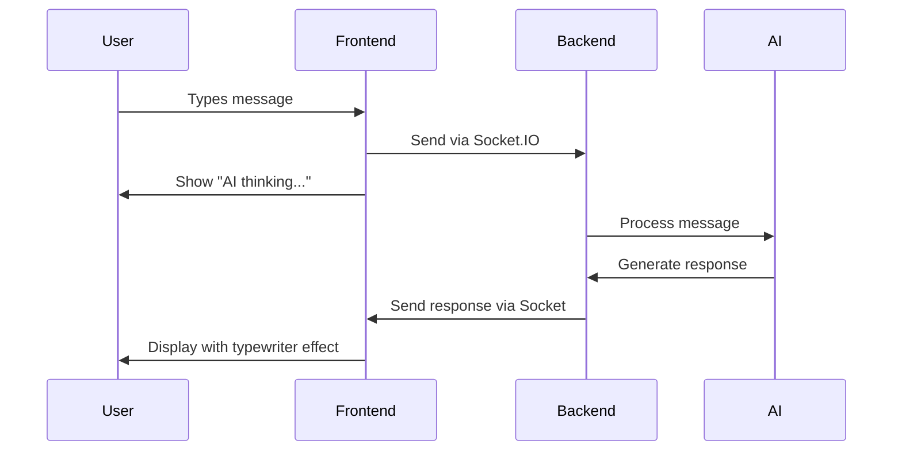

# 🤖 News Chatbot Frontend

<div align="center">

A modern, real-time chat interface built with **React, TypeScript, and Socket.IO** that delivers an engaging conversational experience with an AI-powered news assistant.


- [🚀 Quick Start](#-quick-start)
- [🏗️ Project Structure](#️-project-structure)
- [🎨 Tech Stack](#-tech-stack)
- [🔄 How It Works](#-how-it-works)
- [🧩 Components](#-components)
- [🎨 Styling Architecture](#-styling-architecture)
- [🔌 Real-Time Features](#-real-time-features)
- [📱 Responsive Design](#-responsive-design)
- [🐛 Troubleshooting](#-troubleshooting)
- [🚀 Deployment](#-deployment)

## ✨ Features

### 💬 Real-Time Experience
- **Live typing indicators** when the AI is thinking
- **Instant message delivery** via WebSocket
- **Automatic reconnection** if connection drops
- **Typewriter effect** for AI responses

### 🧠 Smart Conversation Management
- **Persistent sessions** across browser refreshes
- **Full chat history** preservation
- **Easy conversation reset** with one click
- **Source citations** for news responses

### 👨‍💻 Developer-Friendly Architecture
- **Component-based** React architecture
- **TypeScript** for type safety
- **SCSS modules** for organized styling
- **Custom hooks** for state management

## 🚀 Quick Start

### Prerequisites
- Node.js (v18 or higher)
- NPM or Yarn
- Running backend server

### Installation

```bash
# Clone the repository
git clone <your-repo-url>
cd news-chatbot-frontend

# Install dependencies
npm install
```

### Environment Setup

Create a `.env` file in the root directory:

```env
VITE_API_URL=http://localhost:3001
VITE_SOCKET_URL=http://localhost:3001
```

### Start Development

```bash
npm run dev
```

Your chat interface will be available at `http://localhost:5173` 🎉

## 🏗️ Project Structure

```
frontend/
├── src/
│   ├── components/              # React UI components
│   │   ├── ChatInterface.tsx
│   │   ├── MessageList.tsx
│   │   ├── MessageInput.tsx
│   │   └── TypingIndicator.tsx
│   ├── context/                 # React Context providers
│   │   └── SocketContext.tsx
│   ├── hooks/                   # Custom React hooks
│   │   ├── useChat.ts
│   │   └── useSession.ts
│   ├── services/                # API communication
│   │   └── api.ts
│   ├── types/                   # TypeScript definitions
│   │   └── index.ts
│   ├── utils/                   # Helper functions
│   │   └── sessionUtils.ts
│   └── styles/                  # SCSS styling
│       ├── _variables.scss
│       ├── _mixins.scss
│       ├── _backgrounds.scss
│       ├── App.scss
│       └── components/          # Component-specific styles
├── public/                      # Static assets
├── index.html                   # HTML template
├── package.json                 # Dependencies & scripts
├── tsconfig.json               # TypeScript configuration
├── vite.config.ts              # Vite configuration
└── README.md                   # This file
```

## 🎨 Tech Stack

| Technology | Purpose |
|------------|---------|
| **React 18** | Frontend framework with hooks |
| **TypeScript** | Type safety and better DX |
| **Socket.IO Client** | Real-time communication |
| **SCSS** | Styling with component modules |
| **Vite** | Fast build tool and dev server |
| **Axios** | HTTP client for API calls |

## 🔄 How It Works

### Chat Flow


### Session Management
1. 🆔 Generate unique session ID
2. 💾 Store in localStorage
3. 🔌 Connect to Socket.IO room
4. 📚 Load conversation history
5. 💬 Ready for real-time chat!

## 🧩 Components

### 💬 ChatInterface
The main orchestrator that manages the entire chat experience.
- Handles message display and input
- Manages session reset functionality
- Coordinates between child components

### 📝 MessageList
Displays conversation history with rich formatting.
- Typewriter effect for AI responses
- Source citations and timestamps
- Auto-scroll to latest messages

### ⌨️ MessageInput
Smart input component with enhanced UX.
- Auto-resizing textarea
- Enter-to-send, Shift+Enter for new lines
- Loading states and validation

### 🤖 TypingIndicator
Visual feedback for AI processing.
- Animated dots with smooth transitions
- Appears/disappears based on AI status

## 🎨 Styling Architecture

Our SCSS follows a modular, scalable approach:

```scss
styles/
├── _variables.scss      # Colors, fonts, breakpoints
├── _mixins.scss         # Reusable style patterns
├── _backgrounds.scss    # Background patterns & gradients
├── App.scss            # Global application styles
└── components/         # Component-specific styles
    ├── chat-interface.scss
    ├── message-list.scss
    ├── message-input.scss
    └── typing-indicator.scss
```

### Design System
- 🎨 Modern color palette with theme support
- 📱 Mobile-first responsive design
- ✨ Smooth animations and transitions
- 🔤 Clear typography hierarchy

## 🔌 Real-Time Features

### Socket.IO Events

```typescript
// Outgoing events (to server)
socket.emit('join-session', sessionId);
socket.emit('chat-message', message);

// Incoming events (from server)
socket.on('session-history', handleHistory);
socket.on('message-added', handleNewMessage);
socket.on('bot-typing', handleTypingStatus);
```

### Connection Management
- 🔄 Auto-reconnection on network issues
- ⚡ Connection status indicators
- 🛡️ Error handling with user feedback

## 📱 Responsive Design

| Device | Breakpoint | Layout |
|--------|------------|---------|
| **Desktop** | 1200px+ | Full sidebar with spacious messaging |
| **Tablet** | 768-1199px | Compact layout, touch-friendly |
| **Mobile** | 320-767px | Single column, thumb-optimized |

## 🛠️ Available Scripts

```bash
# Development
npm run dev          # Start development server
npm run build        # Build for production
npm run preview      # Preview production build

# Code Quality
npm run lint         # Run ESLint
npm run type-check   # TypeScript type checking
```

## 🐛 Troubleshooting

<details>
<summary><strong>Socket connection fails</strong></summary>

1. Check if backend server is running:
   ```bash
   curl http://localhost:3001/api/health
   ```

2. Verify environment variables:
   ```bash
   echo $VITE_SOCKET_URL
   ```

3. Check browser console for WebSocket errors
</details>

<details>
<summary><strong>Messages not appearing</strong></summary>

1. Verify session ID consistency in localStorage
2. Test backend health endpoint
3. Check browser console for errors
4. Try refreshing the page
</details>

<details>
<summary><strong>Styling issues</strong></summary>

1. Clear browser cache and restart dev server
2. Check SCSS compilation in terminal
3. Verify all imports are correct
4. Check for CSS conflicts in browser DevTools
</details>

## 🚀 Deployment

### Production Build

```bash
npm run build
```

### Environment Variables

```env
# Production settings
VITE_API_URL=https://your-backend-domain.com
VITE_SOCKET_URL=https://your-backend-domain.com
```

### Performance Features
- 📦 Code splitting for faster loads
- 🗜️ Asset optimization via Vite
- 💾 Browser caching for static resources

---

<div align="center">

**Ready to chat?** 🚀

Start your development server and begin conversing with your AI news assistant!

[Report Bug](../../issues) · [Request Feature](../../issues) · [Documentation](../../wiki)

</div>
